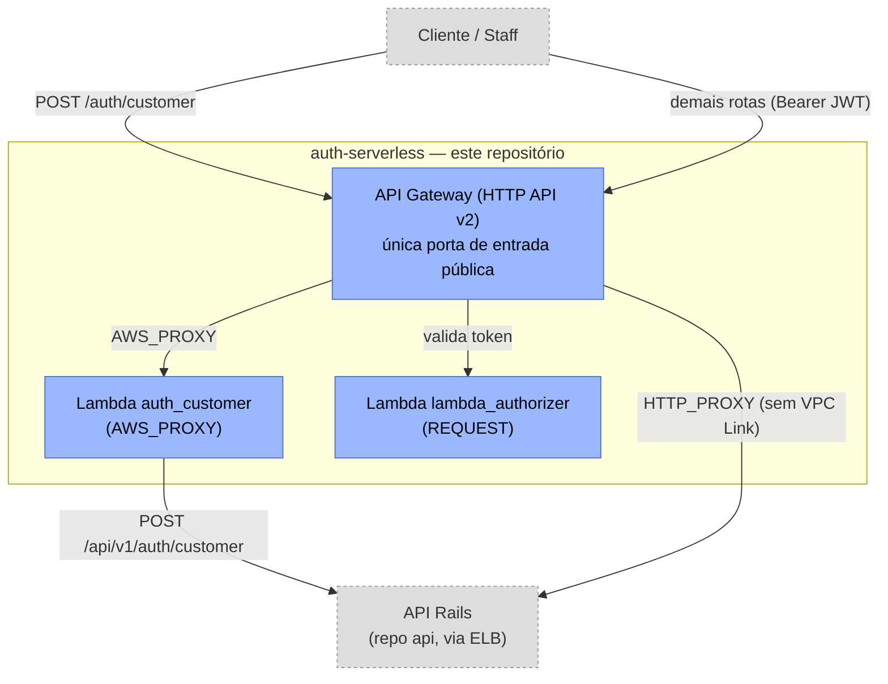

# auth-serverless

**Porta de entrada serverless do sistema**: o API Gateway que expõe publicamente todo o projeto (tanto as Lambdas de autenticação quanto a API Rails) e as Lambdas de autenticação de clientes via CPF e autorização (RBAC) do projeto **Oficina Mecânica** — Fase 3 do Tech Challenge FIAP.

Este repositório é a categoria "**Function Serverless**" exigida pelo desafio — na AWS, API Gateway e Lambda formam um par indissociável (é o Gateway que torna a Lambda invocável via HTTP), por isso o provisionamento do API Gateway vive aqui, e não no `k8s-infra`: ele só pode ser criado *depois* de todo o resto (Lambdas, ELB do Rails) já existir, então não caberia num repositório que é o *primeiro* a ser implantado. Ver ADR 5 e ADR 7 da RFC-001.

Arquitetura completa e decisões (ADRs) na [RFC-001](https://github.com/FIAP-15SOAT-GabrielHelton/api/blob/main/docs/fase3/RFC-001-authentication-authorization-serverless.md), do repositório [`api`](https://github.com/FIAP-15SOAT-GabrielHelton/api).

Este repositório faz parte de um conjunto de 5:

| Repositório | Responsabilidade |
| :--- | :--- |
| [`k8s-infra`](https://github.com/FIAP-15SOAT-GabrielHelton/k8s-infra) | VPC + EKS + node group |
| [`db-infra`](https://github.com/FIAP-15SOAT-GabrielHelton/db-infra) | RDS PostgreSQL |
| [`api`](https://github.com/FIAP-15SOAT-GabrielHelton/api) | Aplicação Rails + ECR + deploy no cluster |
| `auth-serverless` (este repo) | API Gateway (porta de entrada única) + Lambdas de autenticação/RBAC |
| [`deploy-orchestrator`](https://github.com/FIAP-15SOAT-GabrielHelton/deploy-orchestrator) | Dispara e aguarda o deploy dos 4 repos acima, em ordem |

## Tecnologias utilizadas

| Categoria | Tecnologia |
| :--- | :--- |
| Linguagem | TypeScript (Node.js 20.x) |
| Runtime serverless | AWS Lambda (Node.js 20.x), AWS API Gateway (HTTP API v2) |
| Bundling | esbuild (um bundle CJS por Lambda, sem `node_modules` no zip) |
| Autenticação | `jsonwebtoken` (HS256 — mesmo segredo do `Auth::JwtEncoder` da API Rails) |
| Dev local | Express (`local_server.ts`), Docker Compose |
| Testes | Jest + ts-jest |
| IaC | Terraform (`hashicorp/aws` ~> 5.0) |
| CI/CD | GitHub Actions (`ci.yml` em toda PR/push; `cd_deploy.yml`/`cd_destroy.yml` manuais) |

## Arquitetura



## O que tem aqui

- **`auth_customer` (Lambda, `AWS_PROXY`)** — `POST /api/v1/auth/customer`: valida o formato do CPF (Módulo 11) e delega à API Rails (Single Source of Truth) a existência/status do cliente e a emissão do JWT. Rota pública, sem authorizer.
- **`lambda_authorizer` (Lambda, `REQUEST`)** — valida a assinatura (HS256) e expiração do JWT usando o mesmo segredo do `Auth::JwtEncoder` da API Rails, e injeta `{ userId, role, type, cpf }` no contexto repassado ao backend. Não decide RBAC por rota — isso é responsabilidade da API Rails (defesa em profundidade).
- **API Gateway (HTTP API v2)** — única porta de entrada pública do sistema. Rotas públicas (`/auth/login`, `/up`, `/tracking/{protocol}`, `/webhooks/{proxy+}`, `/auth/customer`) fazem `HTTP_PROXY` direto ao ELB público da API Rails (sem VPC Link — ver ADR 5 da RFC-001); a rota protegida `ANY /api/v1/{proxy+}` passa pelo `lambda_authorizer`.

## Documentação da API

Este repositório não mantém uma spec OpenAPI própria — ele é um proxy fino na frente da API Rails, cujo contrato (payloads, status codes, schemas) já está documentado no Swagger do repositório [`api`](https://github.com/FIAP-15SOAT-GabrielHelton/api#documenta%C3%A7%C3%A3o-da-api). O único endpoint específico deste repositório (`POST /auth/customer`) está descrito na seção ["O que tem aqui"](#o-que-tem-aqui) acima e na [RFC-001 §5](https://github.com/FIAP-15SOAT-GabrielHelton/api/blob/main/docs/fase3/RFC-001-authentication-authorization-serverless.md).

## Desenvolvimento local

```bash
docker compose up --build
```

Sobe o servidor local (Express, porta `3001`) simulando o comportamento das rotas do API Gateway, apontando para uma API Rails rodando em `http://host.docker.internal:3000` (`rails s -p 3000` no repositório `api`).

```bash
curl -X POST http://localhost:3001/auth/customer \
  -H "Content-Type: application/json" \
  -d '{"cpf": "52998224725"}'
```

Cenários esperados: CPF válido e cliente ativo → `200` com `access_token`; CPF com formato/dígitos inválidos → `422`; cliente inexistente ou inativo → `401` (repassado da API Rails).

Sem Docker:

```bash
npm install
npm run dev       # servidor local, porta 3001 (lê PORT/JWT_SECRET/RAILS_API_BASE_URL do ambiente)
npm test          # Jest
npm run typecheck # tsc --noEmit
npm run lint      # eslint
```

## CI

Workflow `CI` (`.github/workflows/ci.yml`), disparado em toda Pull Request e em push para `main` — status check exigido pela proteção da branch antes do merge. Passos do job `test`:

1. **Install dependencies** (`npm ci`).
2. **Type check** (`npm run typecheck`) — TypeScript sem `any` implícito escondendo erro de tipo nos handlers/clients.
3. **Lint** (`npm run lint`).
4. **Run tests** (`npm test -- --ci`) — Jest cobrindo `auth_customer`, `rails_client` e o validador de CPF.

## Deploy

Workflow `CD Deploy (Lambdas & API Gateway)` (`.github/workflows/cd_deploy.yml`, `workflow_dispatch`), disparado manualmente com as credenciais temporárias da sessão do AWS Academy. Passos do job `deploy`:

1. **Mask Sensitive Credentials** — mascara credenciais AWS, `JWT_SECRET` e `NEW_RELIC_LICENSE_KEY` no log do Actions.
2. **Install dependencies** + **Build Lambda Bundles** (`npm run build`) — empacota cada handler via esbuild em `build/*.zip`, formato que o Terraform espera para o `aws_lambda_function`.
3. **Configure AWS Credentials** — autentica a sessão via `aws-actions/configure-aws-credentials`.
4. **Bootstrap S3 Backend** — reutiliza (ou cria) o bucket S3 compartilhado de state do Terraform entre os 4 repositórios.
5. **Terraform Provisioning** — `terraform init` + `terraform apply -auto-approve`, provisionando as duas Lambdas, o API Gateway (rotas públicas/protegidas e o authorizer JWT) e lendo a URL pública da API Rails do SSM (publicada pelo repositório `api`). Ao final, imprime a URL do API Gateway como output do job.

**Pré-requisito:** o repositório `api` precisa ter sido implantado antes (publica `/oficina-mecanica/rails_api_base_url` no SSM Parameter Store, que este repositório lê).

**Ordem de deploy do projeto**: `k8s-infra → db-infra → api → auth-serverless` (este repo, por último), ou use o [`deploy-orchestrator`](https://github.com/FIAP-15SOAT-GabrielHelton/deploy-orchestrator).

### Configuração necessária

Secrets do repositório:
- `JWT_SECRET` — **precisa ser exatamente o mesmo valor** usado pela API Rails (`SECRET_KEY_BASE`/`JWT_SECRET` no repositório `api`), já que o `lambda_authorizer` verifica a assinatura HS256 dos tokens emitidos pelo `Auth::JwtEncoder` do Rails.
- `NEW_RELIC_LICENSE_KEY`, `NEW_RELIC_ACCOUNT_ID` — usados pela extensão New Relic nas duas Lambdas (ver [Observabilidade](#observabilidade)).

## Observabilidade

As duas Lambdas (`auth_customer`, `lambda_authorizer`) rodam com a [Lambda Layer do New Relic](https://layers.newrelic-external.com) (Node.js) — instrumentação automática de invocações, sem alterar o código do handler. Ambas emitem logs estruturados em JSON, incluindo o `requestId` do API Gateway. Nas rotas `HTTP_PROXY` (sem Lambda), o próprio API Gateway injeta o header `X-Request-Id` (mapeado de `$context.requestId` em `infra/apigateway.tf`) para correlacionar com os logs/traces da API Rails; na rota via Lambda (`auth_customer`), o mesmo id é propagado manualmente para o Rails via `postToRails`.

Detalhes de arquitetura: [`docs/fase3/architecture/component-diagram.md`](https://github.com/FIAP-15SOAT-GabrielHelton/api/blob/main/docs/fase3/architecture/component-diagram.md#4-monitoramento) (repositório `api`).

## Destroy

Workflow `CD Destroy (Lambdas & API Gateway)`.
